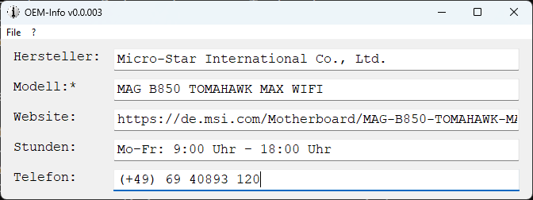
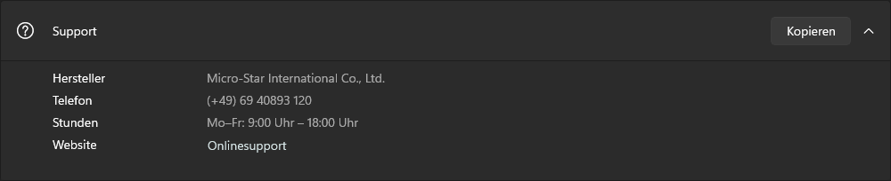

# OEM-Info
Zeigt die OEM-Info von Windows an.

---

## Funktion

Dies ist ein AutoHotkey v2-Skript. Es liest die OEM-Info von Windows aus der Registry aus und zeigt sie an.

---

## Screenshot

---

## Support-Info in Windows 11

---
